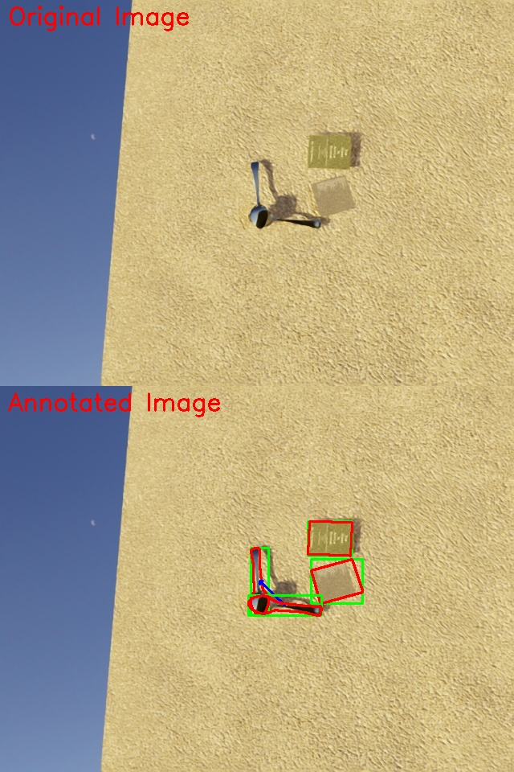

# Isaac-Sim for Relation Dataset Generation

Randomly drop items

Generate coco dataset with bbox

Generate reli dataset with relation, mask, bbox

## Installation

### Isaac-sim Installation

To run project, you need to install isaac-sim in https://docs.isaacsim.omniverse.nvidia.com/4.5.0/installation/download.html (Recommend)

Or install in omniverse(old version): https://developer.nvidia.com/omniverse

> Omniverse Launcher, Nucleus Workstation, and Nucleus Cache will be deprecated and will no longer be available starting October 1, 2025. Functionality may be reduced If these applications are used after this date. Isaac Sim 4.5.0 will be the last release on Omniverse Launcher. See Latest Release instead.

After installation, your isaac-sim may appear in one of two paths below:
```
~/isaacsim
```
or 
```
~/.local/share/ov/pkg/isaac-sim-4.0.0 (may be different version)
```

> The following is based on `~/isaacsim` ; if your environment is `~/.local/share/ov/pkg/isaac-sim-4.0.0`, simply substitute it.

### Python Environment 

We need to install some libraries to Isaac-sim python environment.

Run the following command:

```bash
~/isaacsim/python.sh -m pip install tqdm sklearn
```

### Mesh file

Download mesh file from google drive:

```
https://drive.google.com/drive/folders/1-oYPGcn3tYaxkkuGQEUpgy1ug-rXEnZ1?usp=sharing
```

Put `mesh` folder to Project folder:

```
<path_to_project>
├── code
│   ├── ...
│   ...
├── config
│   ├── ...
│   ...
├── mesh
│   ├── ...
│   ...
├── main.py
├── path_config.py
└── README.md
```
## Run

Run the following command: 

```bash
~/isaacsim/python.sh ./main.py
```
or

```bash
~/.local/share/ov/pkg/isaac-sim-4.0.0/python.sh ./main.py
```

It will generate `result` folder with structure:

```
<path_to_project>/result
├── data/test/camera
|   ├── 0
|   │   ├── camera_<0000~0009>.npz
|   │   ├── metadata.txt
|   │   ├── rgb_<0000~0009>.png
|   │   ├── ...
|   │   └── scene
|   │       ├── label_mapping.txt
|   │       ├── object_data.txt
|   │       ├── occlusion
|   │       │   └── occlusion_tree_<0000~0009>.json
|   │       ├── position
|   │       │   └── position_<0000~0009>.json
|   │       ├── segmentation
|   │       │   └── segmentation_<0000~0009>.json
|   │       ├── scene.ply
|   │       ├── scene.usd
|   │       └── validation.json
|   ├── 1
|   │   ├── ...
|   │   ...
|   ...
|   ├── dataset.json
|   ├── validation_results.txt
|   └── invalid
|       ├── 2
|       │   ├── ...
|       |   ...
|       ...
└── output
    ├── Images
    │   └── <0000~0009>.jpg
    └── Annotations
        ├── visualize
        └── <0000~0009>.json
```

File `dataset.json` in `data/test/camera` is coco dataset.

Folder `result/output/` is reli dataset, and visualization results are in folder `result/output/Annotations/visualize/`

## Parameters

In main.py, simply change `config` to control generation parameters. Some important parameters are:

- **"num_frames"**: Total number of frames to capture in one scene. E.g. if set to 3, there will be 3 pictures in each scene being generated.
- **"start_from"**: Starting scene number for simulation
- **"end_with"**: Ending scene number for simulation

> As dataset generation may takes too much space, we can change `start_from` and `end_with` to generate reli dataset in several step. The newly generated reli dataset will not overwrite the old reli dataset, as long as the `start_from` and `end_with` settings do not overlap each time. However, coco datasets will be overwritten.

## Result

Visualization of reli dataset is as below:

